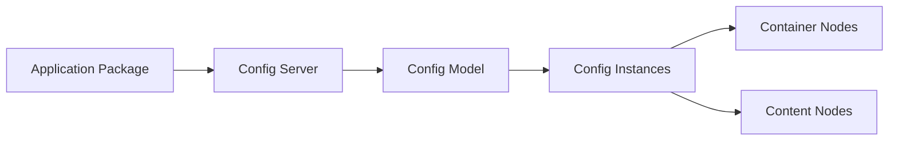

Vespa's architecture consists of three main subsystems that work together to provide a scalable, distributed search and serving platform.

## System Overview

Vespa is built around three core subsystems:

<Steps>
  <Step title="Stateless Container Layer">
    Handles incoming requests and routes them to content nodes
  </Step>
  <Step title="Content Nodes">
    Store data and execute queries (matching, ranking, aggregation)
  </Step>
  <Step title="Configuration System">
    Manages configuration and application deployment
  </Step>
</Steps>

## The Stateless Container

The stateless container layer is the entry point for all requests to Vespa. It's built on the **jDisc** framework and consists entirely of Java components.

### Container Components

<Accordion title="jDisc Core">
  Provides the foundational request-response handling model:
  - Protocol-independent request processing
  - HTTP and other protocol implementations
  - Application lifecycle management
  
  **Module**: [`jdisc_core`](https://github.com/vespa-engine/vespa/tree/master/jdisc_core)
</Accordion>

<Accordion title="jDisc Container">
  Builds on jDisc core with component management:
  - OSGi integration for component bundles
  - Dependency injection framework
  - Metrics and monitoring
  - HTTP connector
  
  **Modules**: [`container-disc`](https://github.com/vespa-engine/vespa/tree/master/container-disc), [`component`](https://github.com/vespa-engine/vespa/tree/master/component)
</Accordion>

<Accordion title="Search Middleware">
  Query and result processing:
  - Query-Result processing framework (Searchers)
  - Query execution logic and dispatch
  - Scatter-gather across content nodes
  - Grouping and aggregation coordination
  
  **Module**: [`container-search`](https://github.com/vespa-engine/vespa/tree/master/container-search)
</Accordion>

### Document Operations

The container layer also handles document write operations:

```java
// Document model - available in both Java and C++
public class Document extends StructuredFieldValue {
    private DocumentId docId;
    private Struct content;
    
    public Document(DocumentType docType, String id) {
        this(docType, new DocumentId(id));
    }
}
```

**Key modules**:
- [`document`](https://github.com/vespa-engine/vespa/tree/master/document) - Document model and operations
- [`messagebus`](https://github.com/vespa-engine/vespa/tree/master/messagebus) - Async multi-hop message passing
- [`docproc`](https://github.com/vespa-engine/vespa/tree/master/docproc) - Document processing chains
- [`indexinglanguage`](https://github.com/vespa-engine/vespa/tree/master/indexinglanguage) - Indexing language implementation

## Content Nodes

Content nodes are where the data lives and where the heavy lifting of search happens. Written entirely in **C++** for performance.

### Core Responsibilities

<CardGroup cols={2}>
  <Card title="Data Storage" icon="database">
    Persistent storage with automatic recovery and replication
  </Card>
  <Card title="Indexing" icon="list-tree">
    Maintains forward and reverse indexes in real-time
  </Card>
  <Card title="Matching" icon="magnifying-glass">
    Finds documents matching the query criteria
  </Card>
  <Card title="Ranking" icon="ranking-star">
    Scores documents using configurable rank profiles
  </Card>
</CardGroup>

### Key Components

**Proton** - The content node server
- **Module**: [`searchcore`](https://github.com/vespa-engine/vespa/tree/master/searchcore)
- Core functionality for indexes, matching, storage, and grouping

**Search Library**
- **Module**: [`searchlib`](https://github.com/vespa-engine/vespa/tree/master/searchlib)
- Ranking framework (feature execution)
- Index and btree implementations
- Attributes (forward indexes)
- Java libraries for ranking

**Storage System**
- **Module**: [`storage`](https://github.com/vespa-engine/vespa/tree/master/storage/src/vespa/storage)
- Elastic, auto-recovering data storage
- Distribution and replication across clusters

**Evaluation Engine**
- **Module**: [`eval`](https://github.com/vespa-engine/vespa/tree/master/eval)
- Efficient evaluation of ranking expressions
- Tensor API and operations

## Configuration and Administration

The configuration system manages the entire Vespa deployment. Implemented in **Java**.

### Configuration Flow



### Key Components

<Accordion title="Config Server">
  Central configuration management:
  - Receives application deployments
  - Serves configuration to all nodes
  - Validates application packages
  
  **Module**: [`configserver`](https://github.com/vespa-engine/vespa/tree/master/configserver)
</Accordion>

<Accordion title="Config Model">
  Models the running system:
  - Processes application package into configs
  - Returns config instances by type and ID
  - Validates configuration consistency
  
  **Module**: [`config-model`](https://github.com/vespa-engine/vespa/tree/master/config-model)
</Accordion>

<Accordion title="Config Client">
  Node-side configuration:
  - Subscribes to configs by type and ID
  - Available in both Java and C++
  - Automatic updates on config changes
  
  **Modules**: [`config`](https://github.com/vespa-engine/vespa/tree/master/config), [`config-proxy`](https://github.com/vespa-engine/vespa/tree/master/config-proxy)
</Accordion>

## Code Map Reference

Vespa consists of approximately **1.7 million lines of code**, split equally between Java and C++. The codebase is organized into about 150 modules in a flat structure.

<Note>
For a complete reference of all modules and their relationships, see the [Code Map](https://github.com/vespa-engine/vespa/blob/master/Code-map.md) in the Vespa repository.
</Note>

### General Utility Libraries

- [`vespalib`](https://github.com/vespa-engine/vespa/tree/master/vespalib) - C++ utility library
- [`vespajlib`](https://github.com/vespa-engine/vespa/tree/master/vespajlib) - Java utility library (includes tensor implementation)

## Request Flow

Here's how a typical search request flows through Vespa:

<Steps>
  <Step title="Request Arrives">
    Client sends HTTP request to container cluster
  </Step>
  <Step title="Query Processing">
    Container processes query through searcher chain
  </Step>
  <Step title="Dispatch">
    Container dispatches query to relevant content nodes
  </Step>
  <Step title="Matching">
    Content nodes find matching documents
  </Step>
  <Step title="Ranking">
    Content nodes score documents using rank profiles
  </Step>
  <Step title="Aggregation">
    Container aggregates results from all content nodes
  </Step>
  <Step title="Response">
    Formatted results returned to client
  </Step>
</Steps>

## Scalability and Distribution

<CardGroup cols={2}>
  <Card title="Horizontal Scaling" icon="arrows-left-right">
    Add more container or content nodes as needed
  </Card>
  <Card title="Data Distribution" icon="network-wired">
    Automatic sharding across content nodes
  </Card>
  <Card title="Replication" icon="copy">
    Configurable redundancy for high availability
  </Card>
  <Card title="Auto-Recovery" icon="rotate">
    Automatic data redistribution on node failures
  </Card>
</CardGroup>

## Next Steps

<CardGroup cols={3}>
  <Card title="Documents" icon="file" href="/concepts/documents">
    Learn about the document model
  </Card>
  <Card title="Schemas" icon="code" href="/concepts/schemas">
    Define your data structures
  </Card>
  <Card title="Search" icon="magnifying-glass" href="/concepts/search">
    Understand how search works
  </Card>
</CardGroup>