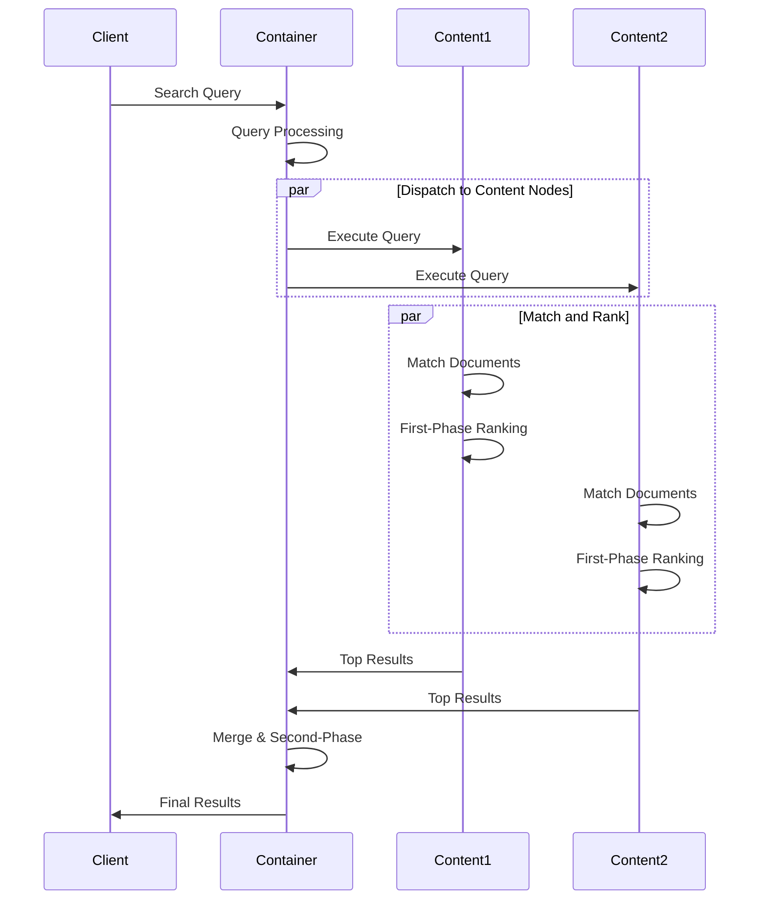

Vespa search is a distributed, two-phase process that efficiently finds and ranks documents at scale. Understanding how search works helps you optimize performance and relevance.

## Search Architecture

Search in Vespa involves coordination between the stateless container layer and content nodes:



## The Two-Phase Process

Vespa uses a two-phase search process to efficiently handle large-scale queries:

<Steps>
  <Step title="Matching Phase">
    Find all documents matching the query criteria
  </Step>
  <Step title="Ranking Phase">
    Score and sort matched documents
  </Step>
</Steps>

### Why Two Phases?

<CardGroup cols={2}>
  <Card title="Efficiency" icon="gauge-high">
    Avoid expensive ranking calculations on documents that don't match
  </Card>
  <Card title="Scalability" icon="arrow-up-right-dots">
    Distribute work across content nodes
  </Card>
  <Card title="Flexibility" icon="sliders">
    Use different ranking strategies per phase
  </Card>
  <Card title="Performance" icon="bolt">
    Rank only the most promising candidates
  </Card>
</CardGroup>

## Matching Phase

The matching phase identifies which documents satisfy the query. This happens on each content node independently.

### Query Types

<Accordion title="Text Search">
  Full-text search using inverted indexes:
  
  ```sql
  select * from article where title contains "vespa"
  ```
  
  - Uses reverse indexes built during document indexing
  - Supports stemming, phrase matching, and linguistic processing
  - Implemented in [`searchlib`](https://github.com/vespa-engine/vespa/tree/master/searchlib)
</Accordion>

<Accordion title="Structured Queries">
  Filtering on attributes:
  
  ```sql
  select * from product where price < 100 and in_stock = true
  ```
  
  - Uses attribute (forward) indexes
  - Fast numeric and boolean comparisons
  - Supports range queries
</Accordion>

<Accordion title="Vector Search">
  Approximate nearest neighbor search:
  
  ```sql
  select * from article where {targetHits:10}nearestNeighbor(embedding, query_embedding)
  ```
  
  - Uses HNSW index for efficient ANN
  - Returns approximate top-k results
  - Configurable accuracy vs speed tradeoff
</Accordion>

<Accordion title="Hybrid Queries">
  Combine multiple query types:
  
  ```sql
  select * from article 
  where 
      userQuery() 
      and published_date > 1609459200
      and {targetHits:20}nearestNeighbor(embedding, query_embedding)
  ```
  
  - Combines text, structured, and vector search
  - Efficient query execution with multiple indexes
</Accordion>

### Query Execution

Query execution is implemented in the `searchlib` module:

**Key Components**:
- **Module**: [`searchlib/src/vespa/searchlib/queryeval`](https://github.com/vespa-engine/vespa/tree/master/searchlib/src/vespa/searchlib/queryeval)
- Search iterators for different query operators (AND, OR, NOT, etc.)
- Blueprint pattern for query optimization
- Lazy evaluation for efficiency

<Note>
Searchlib implements the core matching algorithms used by Proton (the content node server).
</Note>

## Query Language

Vespa supports two primary query languages:

### YQL (Vespa Query Language)

SQL-like syntax for queries:

<CodeGroup>

```sql Simple Query
select * from music where title contains "love"
```

```sql Phrase Query
select * from article where title contains phrase("machine", "learning")
```

```sql Weighted OR
select * from product where 
    title contains ({weight: 200}"laptop") or 
    description contains ({weight: 100}"laptop")
```

```sql Filtering
select * from product where 
    title contains "laptop" and 
    price < 1000 and 
    brand in ("Dell", "HP", "Lenovo")
```

</CodeGroup>

### Simple Query Language

Simpler syntax for basic queries:

```
query=laptop&filter=price:<1000
```

## Matching Operators

Vespa provides various operators for text matching:

<Accordion title="contains">
  Basic term matching:
  ```sql
  where title contains "vespa"
  ```
</Accordion>

<Accordion title="phrase">
  Exact phrase matching:
  ```sql
  where title contains phrase("search", "engine")
  ```
</Accordion>

<Accordion title="near">
  Terms within a distance:
  ```sql
  where title contains near("search", "engine")
  ```
</Accordion>

<Accordion title="onear">
  Ordered terms within a distance:
  ```sql
  where title contains onear("search", "engine")
  ```
</Accordion>

<Accordion title="equiv">
  Match any of several terms:
  ```sql
  where title contains equiv("car", "automobile", "vehicle")
  ```
</Accordion>

<Accordion title="weakAnd">
  Efficient OR with many terms:
  ```sql
  where title contains weakAnd("machine", "learning", "AI", "neural")
  ```
</Accordion>

## Dispatching and Distribution

The container layer coordinates query execution across content nodes:

### Scatter-Gather Pattern

<Steps>
  <Step title="Query Dispatch">
    Container sends query to all content nodes covering the data
  </Step>
  <Step title="Parallel Execution">
    Each content node executes the query on its data partition
  </Step>
  <Step title="Partial Results">
    Each node returns its top-k results
  </Step>
  <Step title="Result Merging">
    Container merges results into final ranking
  </Step>
</Steps>

**Implementation**: [`container-search`](https://github.com/vespa-engine/vespa/tree/master/container-search) module handles query dispatch and result aggregation.

## Search Performance

### Index Types and Performance

<CardGroup cols={2}>
  <Card title="Reverse Index" icon="magnifying-glass">
    Fast text search on indexed fields
  </Card>
  <Card title="Attribute Index" icon="database">
    Fast filtering and ranking on attributes
  </Card>
  <Card title="HNSW Index" icon="diagram-project">
    Fast approximate nearest neighbor search
  </Card>
  <Card title="B-tree Index" icon="tree">
    Fast-search on string attributes
  </Card>
</CardGroup>

### Query Optimization

<Accordion title="Query Rewriting">
  Vespa optimizes queries before execution:
  - Combining similar terms
  - Eliminating redundant clauses
  - Choosing optimal execution order
</Accordion>

<Accordion title="Early Termination">
  Stop searching when enough results are found:
  - Set `hits` parameter for top-k queries
  - Use `targetHits` for approximate search
  - Combine with ranking thresholds
</Accordion>

<Accordion title="Parallel Execution">
  Leverage multiple content nodes:
  - Data is automatically partitioned
  - Queries execute in parallel
  - Linear scalability with more nodes
</Accordion>

## Filtering vs Searching

Understanding the difference is key to performance:

### Filters

Filters use attributes for fast exact matching:

```sql
where price < 100 and category = "electronics"
```

<Check>
  - Fast evaluation using forward indexes
  - No text processing overhead  
  - Efficient for numeric and boolean comparisons
</Check>

### Search

Search uses reverse indexes for text matching:

```sql
where title contains "laptop"
```

<Check>
  - Linguistic processing (stemming, tokenization)
  - Relevance scoring
  - Phrase and proximity matching
</Check>

### Combined Queries

Best performance comes from combining both:

```sql
select * from product 
where 
    title contains "laptop" and  -- Search
    price < 1000 and             -- Filter
    in_stock = true              -- Filter
```

## Grouping and Aggregation

Vespa can group and aggregate results during search:

```sql
select * from product 
where category contains "electronics"
| all(group(brand) each(output(count())))
```

This returns counts per brand without retrieving all documents.

**Implementation**: Grouping happens on content nodes before results are sent to the container, minimizing data transfer.

## Search Implementation Architecture

### Content Node (Proton)

The Proton server handles search on content nodes:

- **Module**: [`searchcore`](https://github.com/vespa-engine/vespa/tree/master/searchcore)
- Manages document storage and indexes
- Executes matching and first-phase ranking
- Returns top results to container

### Search Library

Core search algorithms:

- **Module**: [`searchlib`](https://github.com/vespa-engine/vespa/tree/master/searchlib)
- Query evaluation and matching
- Index implementations (reverse, attribute, HNSW)
- Ranking framework (discussed in Ranking concepts)

## Real-World Query Example

Here's a complete hybrid search query:

```json
{
  "yql": "select * from article where userQuery() and {targetHits:10}nearestNeighbor(embedding, query_embedding)",
  "query": "machine learning",
  "ranking": "semantic_bm25_hybrid",
  "input.query(query_embedding)": [0.12, -0.45, 0.78, ...],
  "filter": "published_date > 1609459200",
  "hits": 20
}
```

This query:
1. Matches documents with "machine learning" text (BM25)
2. Finds nearest neighbors in embedding space (ANN)
3. Filters by publication date
4. Ranks using a hybrid profile
5. Returns top 20 results

## Best Practices

<CardGroup cols={2}>
  <Card title="Use Attributes for Filters" icon="filter">
    Mark filter fields as `attribute` in schema
  </Card>
  <Card title="Index Text Fields" icon="magnifying-glass">
    Use `index` for fields you'll search with text queries
  </Card>
  <Card title="Set targetHits" icon="bullseye">
    Control ANN search quality vs speed
  </Card>
  <Card title="Combine Query Types" icon="layer-group">
    Use hybrid queries for best relevance
  </Card>
</CardGroup>

## Next Steps

<CardGroup cols={3}>
  <Card title="Ranking" icon="ranking-star" href="/concepts/ranking">
    Learn how documents are scored
  </Card>
  <Card title="Schemas" icon="code" href="/concepts/schemas">
    Configure fields for search
  </Card>
  <Card title="Tensors" icon="cube" href="/concepts/tensors">
    Use tensors for semantic search
  </Card>
</CardGroup>