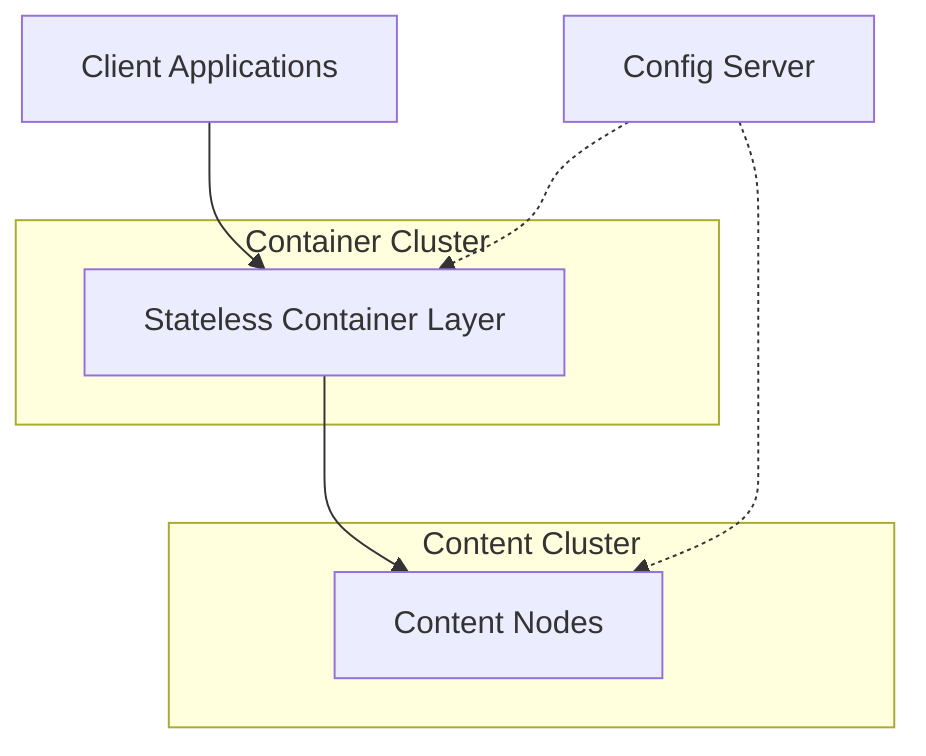

Vespa is an open-source platform for building applications that need to search, make inferences in, and organize vectors, tensors, text, and structured data at serving time and any scale.

## What is Vespa?

Vespa combines the capabilities of a search engine, vector database, and machine learning inference platform into a single unified system. It enables you to select subsets of data from large corpora, evaluate machine-learned models over the selected data, organize and aggregate results, and return them in milliseconds — all while your data corpus is continuously changing.

<Note>
Vespa has been in development for many years and powers several large internet services and applications that serve hundreds of thousands of queries per second.
</Note>

## Key Capabilities

Vespa provides a comprehensive set of features for building modern AI-powered applications:

<CardGroup cols={2}>
  <Card title="Text Search" icon="magnifying-glass">
    Full-text search with BM25 ranking, stemming, and linguistic processing
  </Card>
  <Card title="Vector Search" icon="brain">
    Native support for dense and sparse vectors with approximate nearest neighbor search
  </Card>
  <Card title="Structured Data" icon="database">
    Store and query structured data with powerful filtering and aggregation
  </Card>
  <Card title="ML Inference" icon="microchip">
    Deploy and serve machine learning models with sub-millisecond latency
  </Card>
</CardGroup>

## Use Cases

### Search Applications

Build high-performance search engines that combine traditional text search with modern vector-based semantic search. Vespa supports:

- Full-text search with linguistic processing
- BM25 and other text ranking algorithms
- Faceted search and filtering
- Real-time indexing and updates

### Recommendation Systems

Create personalized recommendation engines that evaluate machine-learned models over large item catalogs:

- Real-time personalization based on user context
- Content-based and collaborative filtering
- Multi-stage ranking with ML models
- A/B testing and experimentation

### Retrieval Augmented Generation (RAG)

Power AI applications with semantic search and vector retrieval:

- Store and search document embeddings
- Hybrid search combining text and vectors
- Fast nearest neighbor search at scale
- Integration with LLM workflows

### Real-Time Analytics

Perform aggregations and analytics over continuously changing datasets:

- Grouping and aggregation queries
- Time-series data analysis
- Real-time dashboards and metrics

## Architecture Overview

Vespa's architecture is designed for high availability, performance, and scalability:



### Stateless Container Layer

The container layer handles:
- Query processing and execution logic
- Document feed processing
- ML model inference
- Custom application components

Implemented in Java, the container layer is horizontally scalable and provides:
- Query parsing and transformation
- Result processing and formatting
- Federation across multiple content clusters
- Custom request handlers and searchers

Source: [container-search](https://github.com/vespa-engine/vespa/tree/master/container-search)

### Content Nodes

Content nodes store data and perform distributed operations:
- Document storage with forward and reverse indexes
- Distributed matching and ranking
- Grouping and aggregation
- Real-time updates

Implemented in C++, content nodes provide:
- High-performance matching over billions of documents
- Feature evaluation and ranking
- Elastic, auto-recovering storage
- Multi-threaded query execution

Source: [searchcore](https://github.com/vespa-engine/vespa/tree/master/searchcore), [searchlib](https://github.com/vespa-engine/vespa/tree/master/searchlib)

### Configuration System

The configuration system manages:
- Application deployment
- Configuration distribution to nodes
- Cluster management
- Health monitoring

Source: [configserver](https://github.com/vespa-engine/vespa/tree/master/configserver)

## Core Concepts

### Schemas

Schemas define the structure of your documents, including fields, indexing, and ranking. Here's a simple example:

```vespa
schema music {
    document music {
        field artist type string {
            indexing: index | summary
            index: enable-bm25
        }
        field title type string {
            indexing: index | summary
        }
    }
    
    fieldset default {
        fields: artist, title
    }
    
    rank-profile default {
        first-phase {
            expression: nativeRank(artist, title)
        }
    }
}
```

### Tensors and Vectors

Vespa has native support for tensors, enabling vector search and ML inference:

```vespa
field embedding type tensor<float>(x[768]) {
    indexing: attribute | index
    index: hnsw
}
```

### Ranking

Ranking expressions define how documents are scored. Vespa supports multi-phase ranking:

```vespa
rank-profile hybrid {
    first-phase {
        expression: bm25(title) + bm25(body)
    }
    second-phase {
        expression: sum(query(q_embed) * attribute(doc_embed))
    }
}
```

## Why Vespa?

<AccordionGroup>
  <Accordion title="Performance at Scale">
    Vespa is built for production workloads, handling hundreds of thousands of queries per second across billions of documents with sub-100ms latency.
  </Accordion>
  
  <Accordion title="Real-Time Operations">
    Updates are immediately available for queries. No batch processing or reindexing required.
  </Accordion>
  
  <Accordion title="Unified Platform">
    Combine text search, vector search, structured data, and ML inference in a single platform instead of stitching together multiple systems.
  </Accordion>
  
  <Accordion title="Production Ready">
    High availability, automatic data distribution, self-healing clusters, and comprehensive monitoring built-in.
  </Accordion>
  
  <Accordion title="Open Source">
    Apache 2.0 licensed with active development. All code is available at [github.com/vespa-engine/vespa](https://github.com/vespa-engine/vespa).
  </Accordion>
</AccordionGroup>

## Next Steps

<CardGroup cols={2}>
  <Card title="Quickstart" icon="rocket" href="/quickstart">
    Get Vespa running locally in minutes
  </Card>
  <Card title="Installation" icon="download" href="/installation">
    Learn about installation options
  </Card>
  <Card title="Sample Applications" icon="flask" href="https://github.com/vespa-engine/sample-apps">
    Explore example applications
  </Card>
  <Card title="Documentation" icon="book" href="https://docs.vespa.ai">
    Deep dive into Vespa features
  </Card>
</CardGroup>

## Community and Support

- **Slack**: Join the [Vespa community on Slack](https://slack.vespa.ai/)
- **GitHub**: Report issues and contribute at [vespa-engine/vespa](https://github.com/vespa-engine/vespa)
- **Blog**: Read the [Vespa Blog](https://blog.vespa.ai/) for updates and use cases
- **Cloud**: Try [Vespa Cloud](https://console.vespa-cloud.com/) for managed hosting